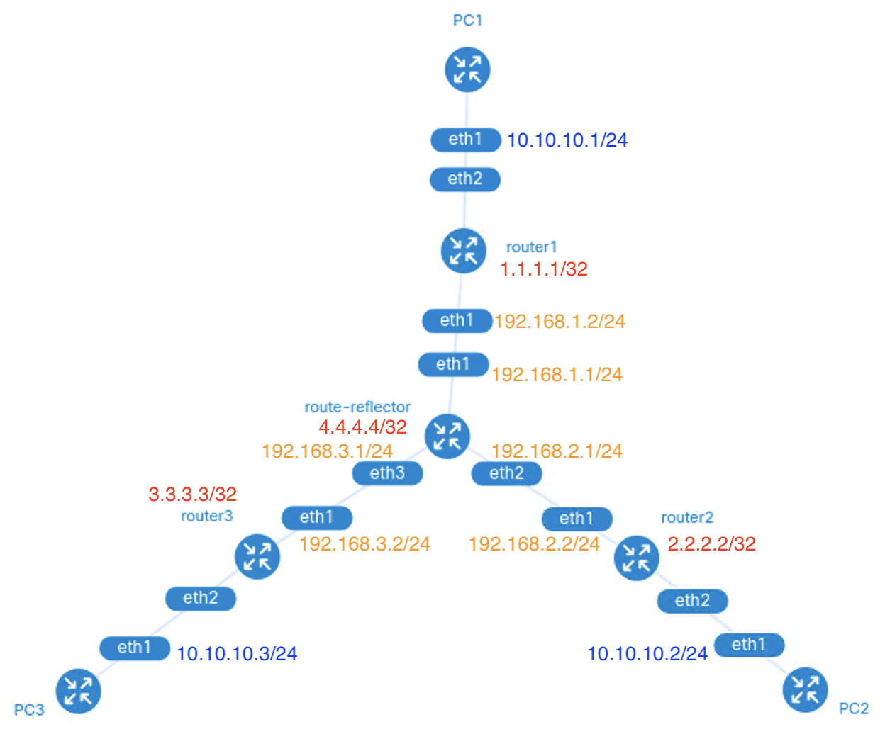

# 3-site EVPN VXLAN with FRR

Deploy a 3-site EVPN VXLAN network with FRR by Containerlab.

## Topology



## Get Started

Deploy the network:

```bash
make deploy
```

Destroy the network:

```bash
make destroy
```

## Test

1.  Enter the bash shell of PC1:

    ```bash
    make PC1.bash
    ```

2.  Ping PC2 and PC3:

    ```bash
    ping 10.10.10.2
    ping 10.10.10.3
    ```

## Handy Commands

See [Makefile](./Makefile).

## References

*   [martimy/clab_vxlan_frr](https://github.com/martimy/clab_vxlan_frr)
*   [VXLAN: BGP EVPN with FRR - Vincent Bernat](https://vincent.bernat.ch/en/blog/2017-vxlan-bgp-evpn#introduction-to-bgp-evpn)
